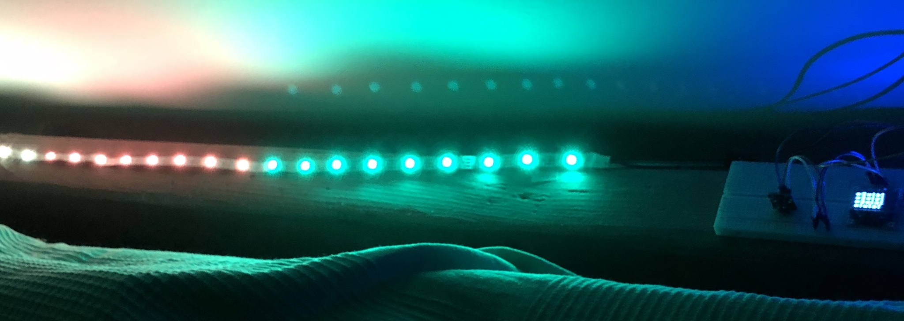

## LED Server Statistics

This uses Data from a WebSocket server to show how many people are currently active on a website.

### Setup

This is a project made with the [platform io](https://platformio.org/) IDE vor Visual Studio Code. Use it and install all dependencies via the IDE.

I used a Wemos D1 Mini and an LED Strip to run the code.

### Hardware used

 - Wemos D1 Mini
 - WS2812B Neopixel LED strip
 - 128 x 64 Pixel OLED I2C display

### Libraries used

 - FastLED
 - WiFi Manager
 - WebSockets Client
 - ArduinoJson